# "Hackathon" de final de _Common Core_, películas

## Índice

* [Preámbulo](#preámbulo)
* [Planeamiento](#planeamiento)
* [Investigación](#investigación)
* [Prototipado](#prototipado)

 ***
# HACKATHON PELÍCULAS

# PREÁMBULO

Con la aparición de plataformas para ver películas en la nube, como Netflix o
Hulu, ver películas desde donde estés, comiendo lo que quieras
(sin tener que pagar precios ridículos por pop-corn / pipoca / palomitas /
canchita / cabritas), parado si es necesario, teniendo acceso a una cantidad
abrumadora de películas... ha cambiado la experiencia del usuario
y modificado el mercado de las películas a nivel global. 

***

# PLANEAMIENTO

Para organizarnos, realizamos nuestra planeación usando trello. También construimos las Historias de Usuarios.

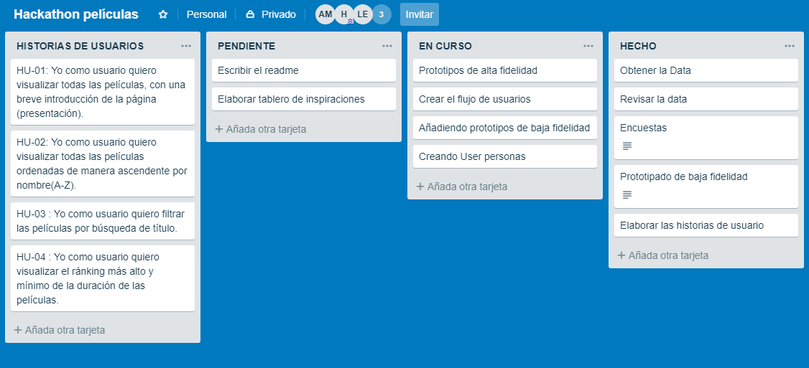

## Historias de Usuarios

HU-01: Yo como usuario quiero visualizar todas las películas, con una breve introducción de la página (presentación).
HU-02: Yo como usuario quiero visualizar todas las películas ordenadas de manera ascendente por nombre(A-Z).
HU-03 : Yo como usuario quiero filtrar las películas por búsqueda de título.
HU-04 : Yo como usuario quiero visualizar el ránking más alto y mínimo de la duración de las películas.

***

# INVESTIGACIÓN

# 1. Encuestas

Decidimos realizar dos encuestas.

## Primera Encuesta

1. Nuestra primera encuesta reúne información sobre la edad del público, el uso de plataformas online y las preferencias sobre géneros.

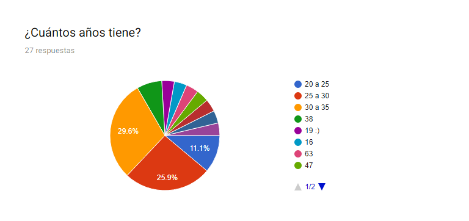
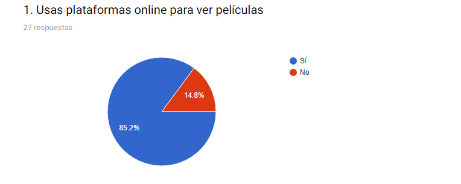
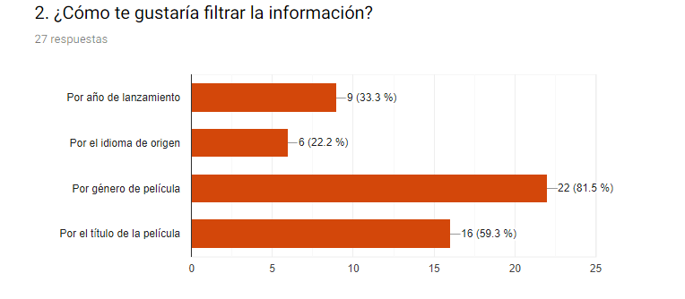
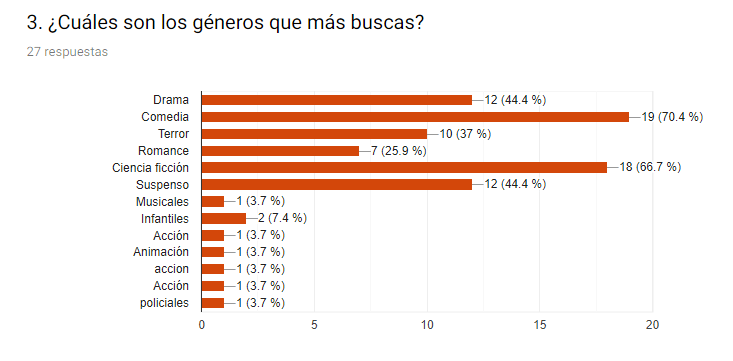
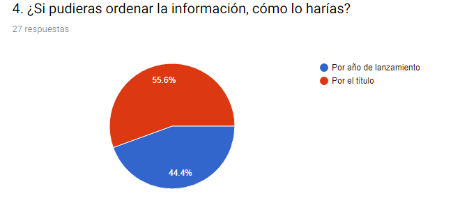
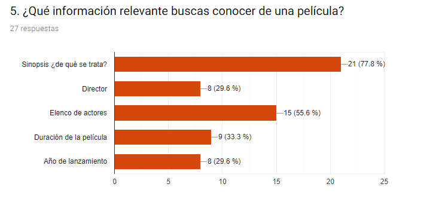

Como conclusión de esta primera encuesta, pudimos observar que:

El rando de edad de la mayría de personas encuestadas se encontraba entre 25 - 35 años. 
De las 27 personas encuestadas, el 85% (23) sí usa una plataforma online para ver películas.
Cómo filtran la información:
La forma más importante de hacerlo fue género y título de la película.
Entre los géneros más buscados, encontramos:
Comedia, Ciencia ficción, drama y suspenso
La mayoría de las personas encuestadas prefiere filtrar la información por el título de la película.
Información relevante que buscan conocer de una película:
Sinopsis, Elenco de actores y en menor medida la duración, el año de lanzamiento y el director.

## Segunda Encuesta

Con los resultados obtenidos en la primera encuesta, decidimos crear una página que solo mostrara películas del género comedia, ya que un buen porcentaje de nuestros usuarios prefería este género.

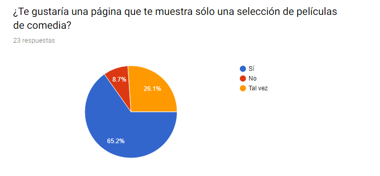
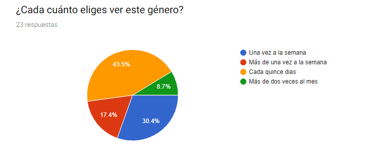
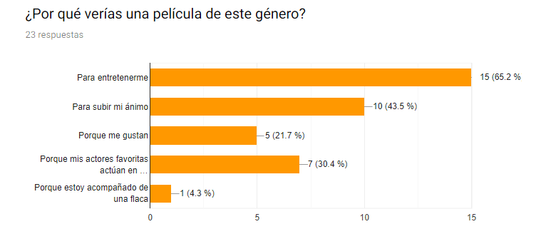
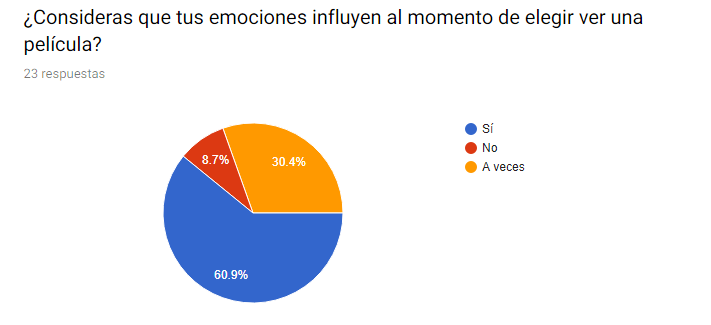
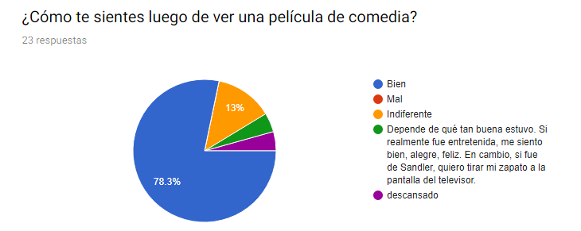

Como resultado de esta segunda encuesta, pudimos concluir que:

Es factible realizar una página que sólo reúna películas del género comedia. Y que nuestros usuarios eligen ver este género para entretenerse o cambiar de humor, ya que sus emociones influyen mucho al momento de realizar su elección.

***

# 1. Nuestros Usuarios

***

# PROTOTIPADO

## Prototipo de Alta Fidelidad

https://marvelapp.com/1ef7fi86

